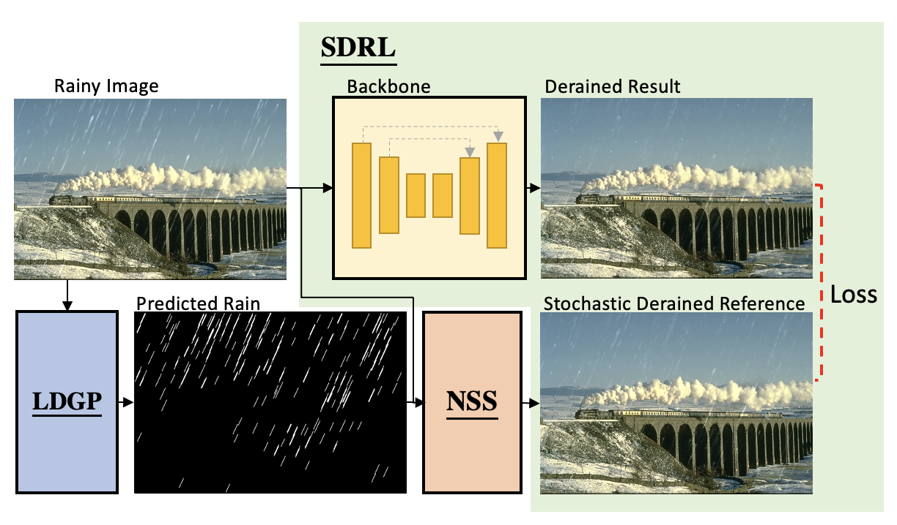
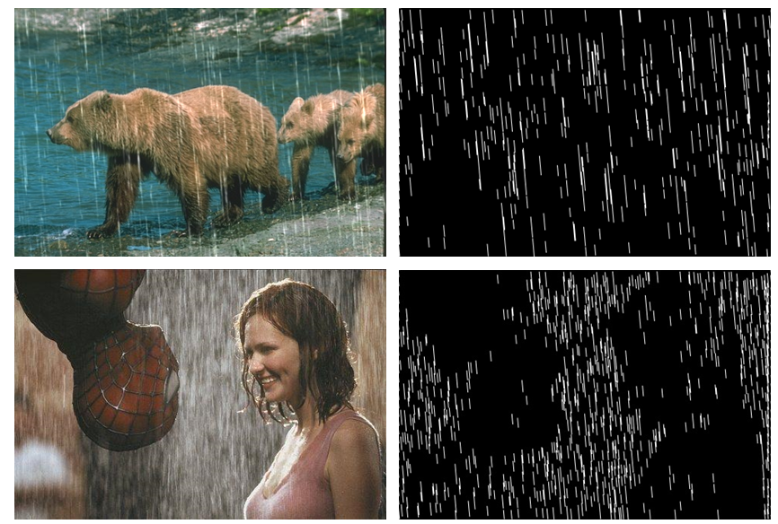

# Rain2Avoid-Self-Supervised-Single-Image-Deraining-with-Non-local-Stochastic-Sampling
[]()

Pytorch Implementation of "Rain2Avoid: Self-Supervised Single Image Deraining"

## Introduction
It is common to take pictures outside; however, the weather may not be good. If we shoot the picture on a rainy day, we might capture rain streaks in the image.
Image deraining is one of the image processing tasks, trying to remove the rain streaks on the image. Most works in these years apply a supervised image-deraining method, which relies on rainy-clean image pairs to train.
However, collecting such pairwise images is strenuous and time-consuming. Therefore, some works generated synthetic rainy images, making it easier to get lots of pairwise images. However, using synthetic images to train a deraining model may not work well on real rainy images.

This paper presents a novel self-supervised method based on locally dominant gradient prior (LDGP) and non-local stochastic sampling (NSS) based on self-similarity which can respectively extract the potential rain streak and generate the stochastic derain reference. With the help of LDGP and NSS, we can self-supervise only one single image for image deraining.
Extensive experiments on synthetic and real image datasets validate the potential of our self-supervised image-deraining method.

## Framework



## Installation
```
pip install -r requirements.txt
```

## Dataset
* **Rain100L**: 200 training pairs and 100 test pairs *[[paper](http://openaccess.thecvf.com/content_cvpr_2017/papers/Yang_Deep_Joint_Rain_CVPR_2017_paper.pdf)][[dataset](http://www.icst.pku.edu.cn/struct/Projects/joint_rain_removal.html)](2017 CVPR)*

* **Rain1400(DDN-Data)**: 12600 training pairs and 1400 test pairs *[[paper](http://openaccess.thecvf.com/content_cvpr_2017/papers/Fu_Removing_Rain_From_CVPR_2017_paper.pdf)][[dataset](https://xueyangfu.github.io/projects/cvpr2017.html)] (2017 CVPR)*

- Please prepare your datsets follow the struture as bellow.
```
./dataset/Rain100L
+--- input
+--- target
+--- ldgp (after run ldgp.py)
+--- sdr  (after run sdr.py)
+--- result (after run sdrl.py)
```

## Command 
### 1. Locally Dominant Gradient Prior (LDGP)
```
python ldgp.py --dataset="Rain100L" --patch_size=80 --kernel_size=10
```

### 2. Non-local Stochastic Sampling (NSS)
```
python sdr.py --input_path="./dataset/Rain100L/input/" --ldgp_path="./dataset/Rain100L/ldgp/" --save_path "./dataset/Rain100L/sdr/" --fuse_save_path "./dataset/Rain100L/sdr(fuse)/"
```

### 3. Stochastic Derained Referenced Learning (SDRL) (Single Self-supervised Training Strategy)
```
python sdrl.py --rainy_data_path="./dataset/Rain100L/" --sdr_data_path="./dataset/Rain100L/sdr/" --result_path="./dataset/Rain100L/result/" --backbone="Unet"
```

- One can use different backbone with --backbone (Options: "Unet", "ResNet", "DnCNN", "Restormer", "DRSFormer")

### 3. (Alternative) Online generate SDR and perform SDRL
```
python sdrl_online.py --rainy_data_path="./dataset/Rain100L/" --sdr_data_path="./dataset/Rain100L/sdr/" --result_path="./dataset/Rain100L/result/" --backbone="Unet"
```


### 3. Stochastic Derained Referenced Learning (SDRL) (Multiple Self-supervised Training Strategy)

### - Train
```
python sdrl_all.py --rainy_data_path="./dataset/Rain100L/" --sdr_data_path="./dataset/Rain100L/sdr/" --result_path="./dataset/Rain100L/result/"
```
### - Inference
```
python test_all.py --data_path="./dataset/Rain100L/" --model_path="./result_all/Rain100L/model.pkl" --result_path="./result_all/Rain100L/image/"
```


## Qualitative result of LDGP

<details>
<summary><strong>LDGP on Rain100L&DDN-SIRR</strong> (click to expand) </summary>
 
</details>


## Deraining Results
<details>
<summary><strong>Qualitative Result on Rain100L</strong> (click to expand) </summary>
 
</details>

<details>
<summary><strong>Quantitative Result on Rain100L</strong> (click to expand) </summary>
 
</details>

<details>
<summary><strong>Quantitative Result on Rain800, DDN-SIRR</strong> (click to expand) </summary>
 
</details>

## Citation
